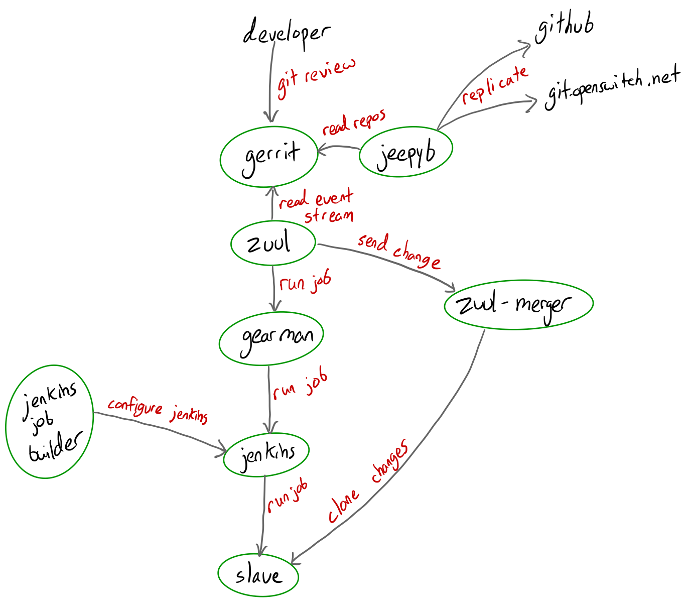

# OpenSwitch Puppet Documentation

New to the team? Start with [onboarding](onboarding.md).

## Contents

- Configuration
  - [Adding a repository to OpenSwitch](configuration/add-repo.md)
  - [Fixing Jeepyb](configuration/jeepyb-close-prs.md)
  - [Moving Docker Installation](configuration/moving-docker-installation.md)
  - [Renewing Puppet Certs](configuration/renewing-puppet-certs.md)
  - [Zuul Troubleshooting](configuration/zuul-troubleshooting.md)

## Zuul/Gerrit CI Overview

